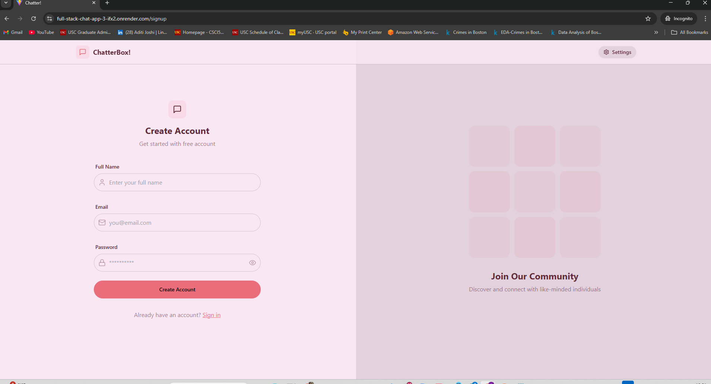
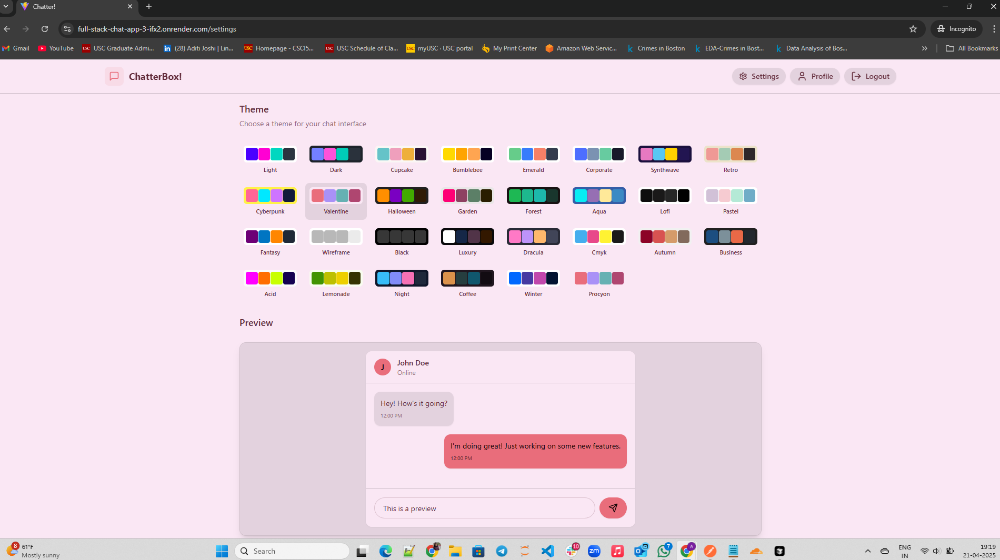
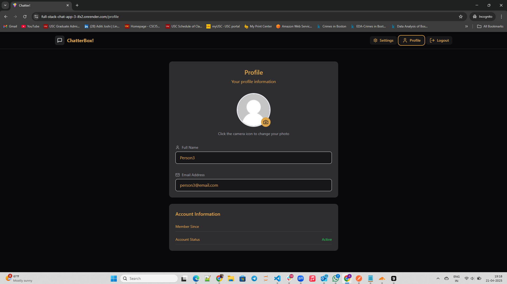
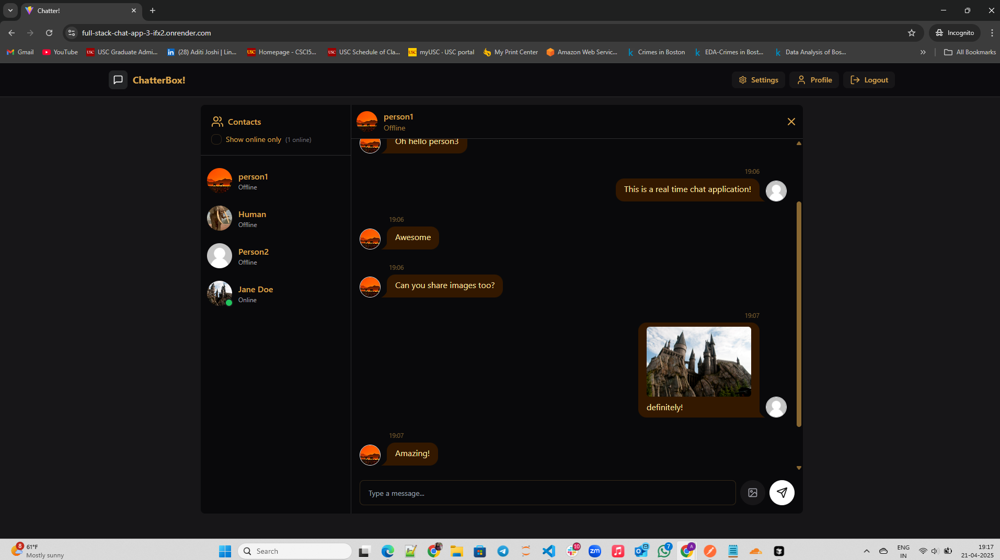

# 💬 Full-Stack Chat App

A real-time chat application built with the MERN stack, WebSockets, and modern UI theming.

🔗 **Live Demo**: https://full-stack-chat-app-3-ifx2.onrender.com

---

## 📌 Overview

This is a full-stack chat app that supports:

- ✅ Real-time messaging via Socket.IO
- 🔒 Secure authentication using JWT & cookies
- 🧾 User profile with Cloudinary-hosted images
- 🌓 Light and dark theme support (DaisyUI)
- 🚀 Deployed on Render (Frontend + Backend)

Users can register, log in, chat with other users, and update their profile pictures.

---

## 🚀 Features

- 🔐 JWT-based authentication (stored in HttpOnly cookies)
- 🧑 Profile management with Cloudinary image uploads
- 💬 Real-time 1-on-1 chat using Socket.IO
- 👥 Online user status tracking
- 📷 Send text, images, or both in messages
- 🌙 Light/Dark theming with DaisyUI
- 🛠️ Zustand state management

---

## 🧰 Tech Stack

### 🔹 Frontend

- React + Vite
- Zustand (state management)
- React Router
- Tailwind CSS + DaisyUI
- Socket.IO Client
- Axios

### 🔸 Backend

- Node.js + Express
- MongoDB + Mongoose
- Socket.IO Server
- JWT for authentication
- Cloudinary for image uploads
- Cookie-parser, CORS

---

## 🧱 Architecture

- REST API handles auth, user, and message operations.
- WebSocket (Socket.IO) handles:
  - Online users
  - Real-time message delivery
- Zustand stores manage:
  - Auth state
  - Chat state (messages, selected user)
- Cloudinary stores:
  - Profile pictures
  - Message images

📡 **Client–Server Flow:**
```
Client (React)
   ↓ Axios
Backend (Express + MongoDB)
   ↑ Socket.IO
Client (Real-time updates)
```

---

## 📸 Screenshots

### Login Page


### Signup page


### Settings Page


### Profile Page


### Chat Interface


---

## 🛠️ Setup Instructions

### 🔧 Prerequisites

- Node.js v18+
- MongoDB URI (Atlas or local)
- Cloudinary Account
- Render (for deployment)

### 🔑 Environment Variables

#### `backend/.env`
```
PORT=5001
MONGO_URI=your_mongodb_uri
JWT_SECRET=your_jwt_secret
CLOUDINARY_CLOUD_NAME=xxx
CLOUDINARY_API_KEY=xxx
CLOUDINARY_API_SECRET=xxx
```

#### `frontend/.env`
```
VITE_SERVER_URL=backend url
```

### 🧪 Running Locally

```bash
# Install deps
npm install

# Start backend
npm run dev --prefix backend

# Start frontend
npm run dev --prefix frontend
```

---

## 🌐 Deployment (Render)

### 🔹 Backend (Web Service)
- Root: `backend/`
- Start command: `npm run start`
- Environment: set all `.env` variables
- WebSocket support enabled by default

### 🔸 Frontend (Static Site)
- Root: `frontend/`
- Build command: `npm run build`
- Publish directory: `frontend/dist`
- Set `VITE_SERVER_URL` to your backend URL

---

## 📁 Folder Structure

```bash
full-stack-chat-app/
├── backend/
│   ├── controllers/
│   ├── models/
│   ├── routes/
│   ├── middleware/
│   └── lib/
├── frontend/
│   ├── src/
│   │   ├── components/
│   │   ├── pages/
│   │   └── store/
└── README.md
```

---

## 📌 Notable Features

- 🔄 Real-time chat with WebSockets
- ⚙️ Modular API with clear controller-routing separation
- 📁 Image support via Cloudinary (Base64 upload)
- 🧠 Zustand for clean, minimal state management
- 📦 Monorepo with unified build scripts

---

## 🤝 Acknowledgements

- [Socket.IO](https://socket.io)
- [Cloudinary](https://cloudinary.com)
- [Render](https://render.com)
- [DaisyUI](https://daisyui.com)
- [MongoDB Atlas](https://www.mongodb.com/cloud/atlas)


